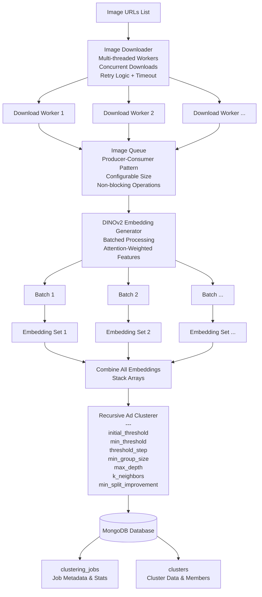

# Pipeline Architecture

```mermaid
graph TB
    A[Image URLs List]
    
    B[Image Downloader<br/>Multi-threaded Workers<br/>Concurrent Downloads<br/>Retry Logic + Timeout]
    B1[Download Worker 1]
    B2[Download Worker 2]
    B3[Download Worker ...]
    
    C[Image Queue<br/>Producer-Consumer Pattern<br/>Configurable Size<br/>Non-blocking Operations]
    
    D[DINOv2 Embedding Generator<br/>Batched Processing<br/>Attention-Weighted Features]
    D1[Batch 1]
    D2[Batch 2]
    D3[Batch ...]
    
    E1[Embedding Set 1]
    E2[Embedding Set 2]
    E3[Embedding Set ...]
    
    F[Combine All Embeddings<br/>Stack Arrays]
    
    G[Recursive Ad Clusterer<br/>---<br/>initial_threshold<br/>min_threshold<br/>threshold_step<br/>min_group_size<br/>max_depth<br/>k_neighbors<br/>min_split_improvement]
    
    H[(MongoDB Database)]
    I[clustering_jobs<br/>Job Metadata & Stats]
    J[clusters<br/>Cluster Data & Members]
    
    A --> B
    B --> B1
    B --> B2
    B --> B3
    B1 --> C
    B2 --> C
    B3 --> C
    C --> D
    D --> D1
    D --> D2
    D --> D3
    D1 --> E1
    D2 --> E2
    D3 --> E3
    E1 --> F
    E2 --> F
    E3 --> F
    F --> G
    G --> H
    H --> I
    H --> J
```
