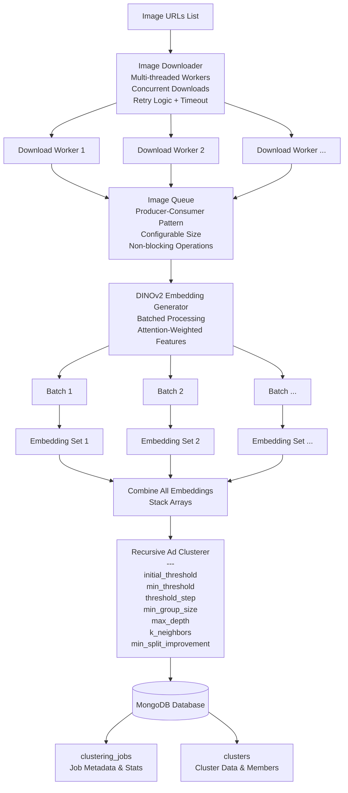

# Ad Clustering Backend

## Watch Short Demo Of Results
- https://drive.google.com/file/d/1l0nMM3VqLv9PWRTv9-L2NmVREAO_ENwI/view?usp=sharing

## 📑 Navigation

- [Pipeline Architecture](#pipeline-architecture)
- [Embedding Generation](#embedding-generation-custom-dinov2-implementation)
- [Clustering Algorithm](#clustering-service-recursive-hierarchical-faiss-clustering)
- [Ideal Architecture](#ideal-architecture)
- [Metrics](#metrics)

---

# Pipeline Architecture

## Embedding Generation: Custom DINOv2 Implementation

### Why DINOv2 over CLIP?

DINOv2 was selected after direct comparison with CLIP embeddings. For advertisement clustering, DINOv2 produced significantly better results by capturing visual similarity (layout patterns, color schemes, compositional elements) rather than semantic concepts. CLIP's text-alignment bias caused it to group ads by subject matter rather than creative style.

### Why Local Deployment?

We deploy DINOv2 locally to generate **custom attention-weighted embeddings** that cannot be obtained from API services.

### Key Innovation: Attention-Based Foreground Emphasis

The model's attention maps identify visually important regions (logos, text overlays, product placements). We extract attention weights from the last transformer layer and apply exponential scaling.

The `emphasis_strength` parameter (default: 2.0) controls how aggressively foreground elements are prioritized—critical for ads where small brand elements or text overlays define visual identity.

### Why 4x Concatenation?

Combining CLS token (global), attention-weighted mean (2x for salient regions), and max-pooling (distinctive features) captures multi-scale information that significantly improves clustering quality for visually complex advertisements. This 3072-dimensional representation outperformed standard 768-dim embeddings in our testing.

---

# Clustering Service: Recursive Hierarchical FAISS Clustering

## Algorithm Overview

### Graph-Based Connected Components

The algorithm builds a similarity graph using FAISS for efficient k-NN search. Ads exceeding a similarity threshold are connected as edges, and connected components in this graph become clusters. This graph-based approach naturally handles arbitrary cluster shapes beyond simple spherical groupings, accommodates varying densities where tight groups and loose groups coexist, and treats isolated nodes as outliers.

### Recursive Threshold Refinement

The clustering begins with a low similarity threshold of 0.75 to form broad initial groups. It then recursively splits clusters by incrementally tightening the threshold in fixed steps of 0.05. The recursion stops when cluster similarity already exceeds 0.96 (accept as final), when a split produces less than 2% improvement (reject split), when cluster size drops below 2 images, or when maximum depth of 10 levels is reached.

### Split Quality Control

Before accepting any split, the algorithm verifies that it meaningfully improves clustering quality. This prevents over-fragmentation where cohesive clusters would be broken into arbitrary subgroups without genuine quality gains.

## Why FAISS?

For 3072-dimensional embeddings, computing all pairwise similarities becomes expensive. A naive approach requires O(n²) comparisons, resulting in over 50 million distance calculations for just 10,000 images. FAISS IndexFlatIP leverages SIMD-optimized inner product search to achieve 10-50x speedup over naive implementations.

## Trade-offs and Proposed Enhancement

### Current Limitation

The fixed threshold increment strategy (0.05 steps) provides predictable behavior but doesn't account for cluster-specific characteristics. Some ad groups are naturally tight with high intra-cluster similarity, while others represent broader visual themes with naturally lower similarity. The uniform stepping approach treats all clusters identically regardless of their inherent cohesion.

### Proposed Enhancement: Adaptive Thresholds

Instead of incrementing thresholds uniformly across all clusters, adapt the threshold based on cluster quality metrics. This would allow the algorithm to be more aggressive with loose clusters (larger threshold jumps) and more conservative with tight clusters (smaller threshold jumps), potentially improving both clustering quality and computational efficiency by reducing unnecessary recursion depth.

---

# Ideal Architecture

## Proposed Solution

### S3-Based Upload Strategy

Images are uploaded directly to S3 rather than passing through application servers. This architecture prevents endpoint bottlenecks and leverages S3's scalability for handling large file uploads.

### Upload Flow

The system provides a pre-signed S3 URL endpoint that returns short-lived upload credentials. Clients upload images directly to S3 using these credentials, bypassing application servers entirely. Each upload is associated with a job ID that tracks the batch of images throughout the clustering pipeline.

### Event-Driven Processing

Once uploads complete, S3 triggers an SNS event that the backend receives. The backend then retrieves the uploaded images from S3 and initiates the clustering process. This asynchronous architecture decouples upload handling from compute-intensive clustering operations.

### Status Tracking

Users can query the processing status using their job ID. The system maintains job state from upload completion through clustering finish, providing visibility into the pipeline without requiring synchronous request-response patterns.

## Benefits

This approach scales horizontally for uploads, reduces backend load by offloading file transfer to S3, and enables asynchronous processing that can handle variable clustering computation times without blocking client connections.

---

# Metrics

- **Pipeline execution time:** On Mac M1, full pipeline takes around **100 seconds for 250 images**.
